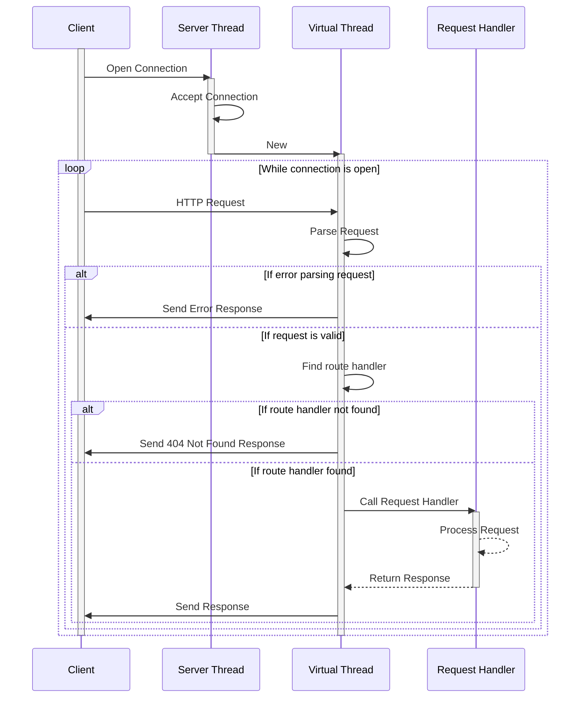

# EmbedHTTP
EmbedHTTP is a lightweight, dependency-free HTTP/1.1 server designed to be easily embedded into existing projects. It provides a simple and efficient way to expose HTTP endpoints, making it ideal for use cases such as Kubernetes probes (e.g., liveness and readiness checks) or exposing metrics for Prometheus.

You can get some insights about the origin of the project from [this](https://docs.google.com/presentation/d/1Azz0ppR3KeAU3aOE51tENJwKmhilMcvCEh70QqamTYk/edit?usp=sharing) presentation.

## Features
- **No Dependencies**: Built without external libraries, ensuring minimal footprint and easy integration.
- **Simple API**: Provides a straightforward interface for defining routes and handling HTTP requests.
- **Lightweight**: Designed to be fast and efficient, making it suitable for low-overhead applications.
- **Customizable**: Easily extendable to fit specific needs, allowing for custom route handling and response types.

## Limitations
- **HTTP/1.1 Only**: Currently supports only HTTP/1.1.
- **No SSL/TLS**: Does not support SSL/TLS.
- **No Built-in Authentication**: Does not include built-in authentication or authorization mechanisms. You can implement these features in your route handlers if needed.
- **No Built-in Middleware**: Does not provide middleware support. You can implement your own middleware-like functionality in the route handlers.
- **No Built-in CORS Support**: Does not include built-in CORS support. You can implement your own CORS handling in the route handlers.
- **No Built-in Request Validation**: Does not include built-in request validation. You can implement your own request validation in the route handlers.
- **No Built-in Response Compression**: Does not include built-in response compression. You can implement your own response compression in the route handlers.
- **No Built-in Error Handling**: Does not include built-in error handling. You can implement your own error handling in the route handlers.
- **Only text base body**: Currently, only text-based bodies are supported. 

## Getting Started

### Adding EmbedHTTP to Your Project
We can add EmbedHTTP to your project using Maven or Gradle.

#### Maven
```pom
<dependency>
    <groupId>net.uiqui</groupId>
    <artifactId>embedhttp</artifactId>
    <version>0.5.5</version>
</dependency>
```

#### Gradle
```groovy
implementation 'net.uiqui:embedhttp:0.5.5'
```


### Example Usage
Below is an example of how to use EmbedHTTP to expose some endpoints like a liveness probe and a metrics endpoint.

#### 1. Define Your Routes

```java
import net.uiqui.embedhttp.Router;
import net.uiqui.embedhttp.api.ContentType;
import net.uiqui.embedhttp.api.HttpHeader;
import net.uiqui.embedhttp.api.HttpResponse;
import net.uiqui.embedhttp.api.HttpStatusCode;

public class ExampleRoutes {
    public static Router createRouter() {
        var api = Router.newRouter();
        
        api.put("/resource/:id", request -> {
            var id = request.getPathParameter("id");
            var name = request.getQueryParameter("name");
            if (name == null || name.isEmpty()) {
                return HttpResponse.badRequest()
                        .setBody(ContentType.TEXT_PLAIN, "Name parameter is required.");
            }
            // Add to queue for resource update logic
            var response = "Resource " + id + " name's will be updated to " + name + ".";
            return HttpResponse.withStatus(HttpStatusCode.ACCEPTED)
                    .setHeader(HttpHeader.CACHE_CONTROL, "no-cache")
                    .setBody(ContentType.TEXT_PLAIN, response);
        });
        
        api.get("/health", request -> {
            // Check system health
            return HttpResponse.ok()
                    .setBody(ContentType.TEXT_PLAIN, "OK");
        });
        
        api.get("/metrics", request -> {
            var metrics = "metric_name 123";
            return HttpResponse.ok()
                    .setBody(ContentType.TEXT_PLAIN, metrics);
        });
        
        return api;
    }
}
```

Or you can define your routes in a more compact way:

```java
var api = Router.newRouter()
        .put("/resource/:id", request -> {
            // Some logic for handling the PUT /resource/:id
        })
        .get("/health", request -> {
            // Some logic for handling the GET /health
        })
        .get("/metrics", request -> {
            // Some logic for handling the GET /metrics 
        });
```

#### 2. Start the Server

```java
import net.uiqui.embedhttp.HttpServer;

public class Main {
    public static void main(String[] args) throws Exception {
        var router = ExampleRoutes.createRouter();
        var server = HttpServer.newInstance(8080);

        if (server.start(router)) {
            System.out.println("Server started on port: " + server.getInstancePort());
        } else {
            System.err.println("Failed to start the server.");
        }
    }
}
```

#### 3. Access Your Endpoints
Once the server is running, you can access the endpoints using a web browser or tools like `curl`:

```bash
$ curl -v -X PUT http://localhost:8080/resource/123?name=test
< HTTP/1.1 202 Accepted
< Cache-Control: no-cache
< Content-Length: 44
< Content-Type: text/plain
< Date: Sun, 11 May 2025 09:53:37 GMT
< 
Resource 123 name's will be updated to test.
```

```bash
$ curl -v http://localhost:8080/health
< HTTP/1.1 200 OK
< Content-Length: 2
< Content-Type: text/plain
< Date: Sun, 11 May 2025 09:55:49 GMT
< 
OK
```

```bash
$ curl -v http://localhost:8080/metrics
< HTTP/1.1 200 OK
< Content-Length: 15
< Content-Type: text/plain
< Date: Sun, 11 May 2025 09:57:24 GMT
< 
metric_name 123
```

## Benchmark
To assess the performance of EmbedHTTP, we conducted a benchmark against Spring Boot using the [TestEmbedHTTP](https://github.com/jjmrocha/TestEmbedHTTP) repository. 
The evaluation involved running a 120-second load test with the [Beast](https://github.com/jjmrocha/beast) stress testing tool.

Given the project's goal, to provide a lightweight HTTP server without the overhead of a full-featured HTTP server. We simulated a realistic scenario with two permanently concurrent client requests. 
The stress test results are the following:
```
===== System =====
Operating System: darwin
System Architecture: arm64
Logical CPUs: 8
===== Test =====
Request template: get-plain.yaml
Sample Data: test-data.csv
Configuration: beast-config.json
Test duration: 120 seconds
Number of concurrent requests: 2
===== Preparing =====
- Reading configuration
- Loading request template
- Loading data file
===== Executing =====
2025/05/15 09:07:56 [#...................] 5%
2025/05/15 09:08:02 [##..................] 10%
2025/05/15 09:08:08 [###.................] 15%
2025/05/15 09:08:14 [####................] 20%
2025/05/15 09:08:20 [#####...............] 25%
2025/05/15 09:08:26 [######..............] 30%
2025/05/15 09:08:32 [#######.............] 35%
2025/05/15 09:08:38 [########............] 40%
2025/05/15 09:08:44 [#########...........] 45%
2025/05/15 09:08:50 [##########..........] 50%
2025/05/15 09:08:56 [###########.........] 55%
2025/05/15 09:09:02 [############........] 60%
2025/05/15 09:09:08 [#############.......] 65%
2025/05/15 09:09:14 [##############......] 70%
2025/05/15 09:09:20 [###############.....] 75%
2025/05/15 09:09:26 [################....] 80%
2025/05/15 09:09:32 [#################...] 85%
2025/05/15 09:09:38 [##################..] 90%
2025/05/15 09:09:44 [###################.] 95%
2025/05/15 09:09:50 [####################] 100%
===== Stats =====
Executed requests: 2783401
Time taken to complete: 2m0.000279666s
Requests per second: 24614.6951
Avg response time: 81.252µs
===== Status 200 =====
2783401 requests, with avg response time of 81.252µs
And the following distribution:
- The fastest request took 24.167µs
- 20% of requests under 62.834µs
- 40% of requests under 72.25µs
- 60% of requests under 81.708µs
- 80% of requests under 95.209µs
- 90% of requests under 108.291µs
- 95% of requests under 122.417µs
- 99% of requests under 167.041µs
- The slowest request took 23.134292ms
```

Surprisingly, the EmbedHTTP 0.5.4 version performs on par with Spring Boot,
achieving an impressive 91318K requests per second with an average response time of 700 microseconds,
under a load of 64 concurrent requests:


## How it works

The following sequence diagram illustrates the flow of a request through the EmbedHTTP server:


## Documentation
The JavaDoc documentation for project is available on the [javadoc.io](https://www.javadoc.io/doc/net.uiqui/embedhttp/latest/index.html) site.

## License
EmbedHTTP is licensed under the MIT License. See the [LICENSE](LICENSE) file for more details.

## Contributing
Contributions are welcome! If you have suggestions for improvements or new features, please open an issue or submit a pull request.
